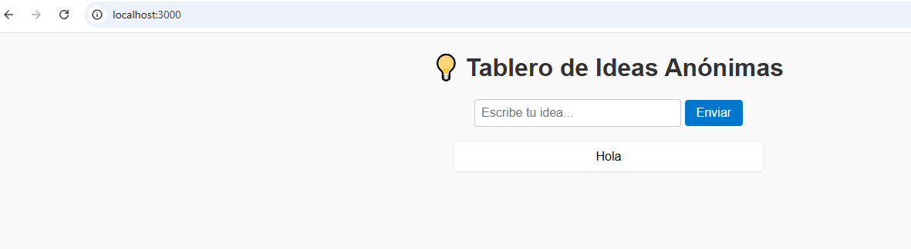
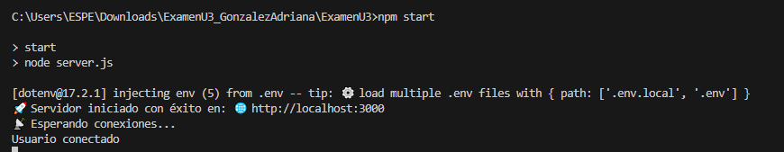
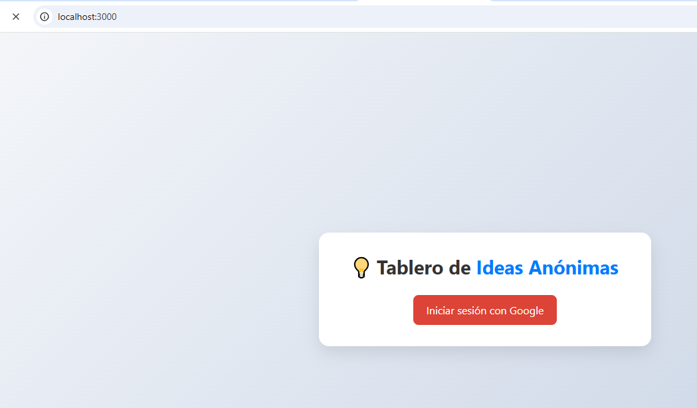
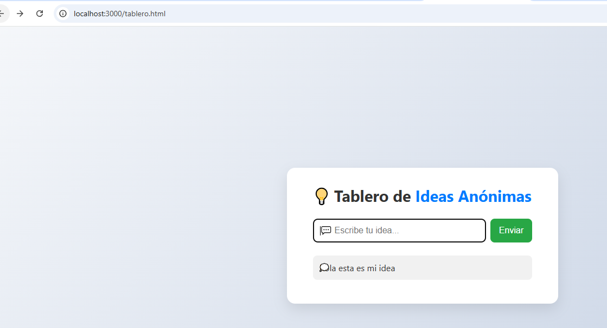

# Examen Unidad 3 - Proyecto Distribuidas | Programación Avanzada 202550

Este repositorio contiene la solución al **Examen Práctico de la Unidad 3** para la asignatura **Programación Avanzada 202550**.  
El proyecto consiste en implementar un backend funcional con OAuth 2.0, JWT para gestión de sesiones y comunicación en tiempo real con Socket.io, desplegado en un servicio en la nube.

---

## 🎯 Objetivo del proyecto

Configurar, integrar y desplegar un backend funcional que incorpore:

- Flujo de autenticación OAuth 2.0 con un proveedor externo (Google).
- Emisión y validación de JSON Web Tokens (JWT) para gestión de sesiones y protección de rutas.
- Comunicación en tiempo real con Socket.io.
- Despliegue del backend en Railway o servicio similar.

---

## 🧰 Tecnologías utilizadas

- **Backend:** Node.js con Express  
- **Autenticación:** OAuth 2.0 con Google  
- **Gestión de sesiones:** JSON Web Tokens (JWT)  
- **Comunicación en tiempo real:** Socket.io  
- **Despliegue:** Railway  
- **Control de versiones:** Git y GitHub  

---

## 🔥 Funcionalidades implementadas

- Login vía OAuth 2.0 con Google  
- Generación y validación de JWT para proteger rutas  
- Ruta protegida de ejemplo `/api/profile` que devuelve datos del usuario autenticado  
- Comunicación en tiempo real usando Socket.io (según tema asignado)  
- Gestión básica de sesiones y estado del usuario  
- Código fuente gestionado con commits claros y descriptivos  

---

## 📁 Estructura del proyecto

ExamenU3/
│
├── backend/ # Código backend y API REST
├── capturas/ # Evidencias gráficas del proyecto
│ ├── acceso.PNG
│ ├── accesoidea.PNG
│ ├── conectado.PNG
│ ├── idea.PNG
│ └── tablero.PNG
├── .env # Variables de entorno (no subir a repositorio)
├── package.json
├── server.js # Archivo principal backend
└── README.md # Este archivo

yaml
Copiar
Editar

---

## 📷 Capturas de pantalla

- Acceso a la aplicación  

- Ejemplo de idea enviada en tiempo real  

- Estado conectado y comunicación en tiempo real  

- Tablero principal con datos en vivo  

- Pantalla de acceso con OAuth  

---

## 🌐 URLs públicas

- Backend desplegado (Railway): [https://tu-backend-railway-url.app](https://tu-backend-railway-url.app)  
- Frontend (si aplica): [https://tu-frontend-url.netlify.app](https://tu-frontend-url.netlify.app)

---

## 📈 Plan de monitoreo básico

- Tiempo de actividad (Uptime) con UptimeRobot o similar  
- Tiempo de respuesta de la API  
- Tasa de errores 5xx  
- Dashboard con evidencias en la carpeta `capturas`

---

## 📚 Bibliografía y referencias

- Documentación oficial OAuth 2.0 Google: https://developers.google.com/identity  
- Documentación oficial Node.js y Express: https://expressjs.com  
- Documentación Socket.io: https://socket.io  
- Documentación Railway: https://railway.app  

---

## 🙋‍♀️ Autor

**Adriana Pamela González Orellana**  
Correo: apgonzalez1@espe.edu.ec  
GitHub: [@Apgonzlez1](https://github.com/Apgonzlez1)  

---

## 📚 Asignatura

Programación Avanzada 202550  
Unidad 3 - Examen Práctico - Ciclo DevOps  

---

¡Gracias por revisar este proyecto!
